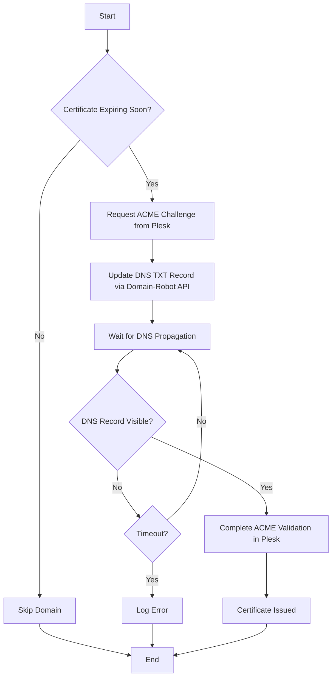

# dns01-bot

[](https://go.dev/)
[](LICENSE)
[](CONTRIBUTING.md)

> A lightweight Go daemon that automates Let's Encrypt wildcard certificate management for Plesk servers using DNS-01 challenges via the Domain-Robot API.

## 🎯 Overview

**dns01-bot** eliminates the manual hassle of managing wildcard SSL certificates on Plesk servers. It seamlessly integrates Plesk's SSL It! extension with Domain-Robot's DNS API to:

- ✅ Automatically obtain and renew wildcard certificates
- ✅ Manage DNS-01 ACME challenges programmatically
- ✅ Monitor certificate expiry and renew proactively
- ✅ Run unattended via cron for zero-touch operation

Perfect for DevOps teams managing multiple domains on Plesk infrastructure with Domain-Robot DNS.

---

## 📋 Table of Contents

- [Features](#-features)
- [How It Works](#-how-it-works)
- [Prerequisites](#-prerequisites)
- [Installation](#-installation)
- [Configuration](#-configuration)
- [Usage](#-usage)
- [Automation](#-automation)
- [Troubleshooting](#-troubleshooting)
- [Security](#-security)
- [Contributing](#-contributing)
- [License](#-license)

---

## ✨ Features

- **🔒 Wildcard Certificate Support** - Secure `*.example.com` with a single certificate
- **🤖 Intelligent Renewal** - Automatically checks certificate expiry and renews when needed
- **🌐 DNS Automation** - Manages `_acme-challenge` TXT records via Domain-Robot API
- **⏱️ Smart Propagation Waiting** - Verifies DNS changes before proceeding with ACME validation
- **📝 Simple Configuration** - Environment variables and plaintext domain list
- **🔄 Cron-Ready** - Designed for unattended scheduled execution
- **📊 Detailed Logging** - Comprehensive output for monitoring and debugging

---

## 🔧 How It Works



### Process Flow

For each configured domain:

1. **📅 Certificate Check**
   - Opens TLS connection to `domain:443`
   - Extracts certificate expiry date
   - Skips if > `RENEW_BEFORE_DAYS` remain

2. **🎫 ACME Challenge Initiation**
   ```bash
   plesk ext sslit --certificate -issue -domain example.com -wildcard
   ```
   - Parses output for `dnsRecordHost` and `dnsRecordValue`

3. **🌍 DNS Record Management**
   - Authenticates with Domain-Robot API
   - Locates DNS zone for domain
   - Creates or updates `_acme-challenge` TXT record

4. **⏳ Propagation Verification**
   - Polls DNS every `DNS_CHECK_INTERVAL_SECONDS`
   - Validates TXT record matches expected token
   - Times out after `DNS_TIMEOUT_SECONDS`

5. **✅ Certificate Finalization**
   ```bash
   plesk ext sslit --certificate -issue -domain example.com -continue
   ```
   - Completes ACME validation
   - Installs wildcard certificate in Plesk

---

## 📦 Prerequisites

| Component | Requirement |
|-----------|-------------|
| **OS** | Linux (tested on Debian/Ubuntu) |
| **Control Panel** | Plesk Obsidian with SSL It! extension |
| **Go** | 1.21+ (for building) |
| **DNS Provider** | Domain-Robot (InterNetX) with API access |
| **Permissions** | Root or sudo access |

### Domain-Robot Setup

1. Enable API access in your Domain-Robot account
2. Whitelist your server's IP address
3. Ensure DNS zones are managed via Domain-Robot

---

## 🚀 Installation

### Option 1: Download Pre-built Binary (Recommended)

```bash
# Download latest release
wget https://github.com/yourusername/dns01-bot/releases/latest/download/dns01-bot

# Install system-wide
sudo mv dns01-bot /usr/local/bin/
sudo chmod +x /usr/local/bin/dns01-bot

# Verify installation
dns01-bot --version
```

### Option 2: Build from Source

```bash
# Clone repository
git clone https://github.com/yourusername/dns01-bot.git
cd dns01-bot

# Build binary
go build -o dns01-bot -ldflags="-s -w" .

# Install
sudo mv dns01-bot /usr/local/bin/
sudo chmod +x /usr/local/bin/dns01-bot
```

### Create Configuration Directory

```bash
sudo mkdir -p /etc/dns01-bot
sudo chmod 755 /etc/dns01-bot
```

---

## ⚙️ Configuration

### 1. Domain List (`domains.conf`)

Create `/etc/dns01-bot/domains.conf`:

```bash
# Format: domain email
example.com      admin@example.com
example.org      noc@example.org
mysite.net       ssl@mysite.net
```

**Format Rules:**
- One domain per line
- Whitespace-separated: `<domain> <email>`
- Lines starting with `#` are comments
- Empty lines are ignored

### 2. Environment Configuration (`.env`)

Create `/etc/dns01-bot/.env`:

```bash
# Domain-Robot API Credentials
DR_BASE_URL=https://domain-robot.de/api
DR_EMAIL=your-email@example.com
DR_PASS=your-password
DR_OTP=  # Leave empty if OTP not required

# Certificate Renewal Settings
RENEW_BEFORE_DAYS=31  # Renew when ≤ 31 days remain

# DNS Challenge Configuration
DNS_TIMEOUT_SECONDS=600          # Max wait for DNS propagation (10 min)
ACME_TTL_SECONDS=60              # TTL for _acme-challenge records
DNS_CHECK_INTERVAL_SECONDS=15    # Polling interval

# Paths
DOMAINS_CONF=/etc/dns01-bot/domains.conf
```

**Secure the configuration:**

```bash
sudo chmod 600 /etc/dns01-bot/.env
sudo chown root:root /etc/dns01-bot/.env
```

### Configuration Reference

| Variable | Default | Description |
|----------|---------|-------------|
| `DR_BASE_URL` | `https://domain-robot.de/api` | Domain-Robot API endpoint |
| `DR_EMAIL` | *required* | Domain-Robot login email |
| `DR_PASS` | *required* | Domain-Robot password |
| `DR_OTP` | *(empty)* | One-time password (if enabled) |
| `RENEW_BEFORE_DAYS` | `31` | Renew threshold in days |
| `DNS_TIMEOUT_SECONDS` | `600` | DNS propagation timeout |
| `ACME_TTL_SECONDS` | `60` | TXT record TTL |
| `DNS_CHECK_INTERVAL_SECONDS` | `15` | DNS check interval |
| `DOMAINS_CONF` | `/etc/dns01-bot/domains.conf` | Domain list path |

---

## 💻 Usage

### Manual Execution

For testing or one-off renewals:

```bash
cd /etc/dns01-bot
set -a; source .env; set +a
dns01-bot
```

**Example output:**

```
2024-01-15 10:30:00 dns01-bot starting
2024-01-15 10:30:01 Domain-Robot login ok
2024-01-15 10:30:02 === processing domain example.com ===
2024-01-15 10:30:03 [cert] example.com expires at 2024-02-10T10:30:00Z (in 26 days)
2024-01-15 10:30:05 [plesk] challenge for example.com: host=_acme-challenge value=abc123...
2024-01-15 10:30:06 [dns] creating TXT _acme-challenge.example.com
2024-01-15 10:30:45 [dns] TXT for _acme-challenge.example.com ok: abc123...
2024-01-15 10:31:20 === done for example.com ===
2024-01-15 10:31:20 dns01-bot finished
```

### Interactive Mode (with OTP)

If your Domain-Robot account requires OTP:

```bash
# Create helper script
sudo tee /usr/local/bin/run-dns01-bot > /dev/null <<'EOF'
#!/bin/bash
set -euo pipefail

cd /etc/dns01-bot
set -a; source .env; set +a

read -p "Domain-Robot OTP: " DR_OTP
export DR_OTP

dns01-bot | tee -a /var/log/dns01-bot.log
EOF

sudo chmod +x /usr/local/bin/run-dns01-bot
sudo touch /var/log/dns01-bot.log
```

**Usage:**

```bash
sudo run-dns01-bot
# Enter OTP when prompted
```

---

## 🤖 Automation

### Cron Setup (OTP-Free Accounts)

For unattended operation without OTP requirement:

**1. Create Cron Wrapper:**

```bash
sudo tee /usr/local/bin/dns01-bot-cron > /dev/null <<'EOF'
#!/bin/bash
set -euo pipefail

cd /etc/dns01-bot || exit 1
set -a; source .env; set +a

dns01-bot >> /var/log/dns01-bot.log 2>&1
EOF

sudo chmod +x /usr/local/bin/dns01-bot-cron
sudo touch /var/log/dns01-bot.log
```

**2. Test Wrapper:**

```bash
sudo /usr/local/bin/dns01-bot-cron
sudo tail -f /var/log/dns01-bot.log
```

**3. Add to Crontab:**

```bash
sudo crontab -e

# Add this line (runs every 12 hours at :00)
0 */12 * * * /usr/local/bin/dns01-bot-cron
```

**Alternative Schedules:**

```bash
# Daily at 3 AM
0 3 * * * /usr/local/bin/dns01-bot-cron

# Weekly on Sundays at 2 AM
0 2 * * 0 /usr/local/bin/dns01-bot-cron

# Twice daily at 6 AM and 6 PM
0 6,18 * * * /usr/local/bin/dns01-bot-cron
```

### Log Rotation

Configure logrotate to prevent log file growth:

```bash
sudo tee /etc/logrotate.d/dns01-bot > /dev/null <<'EOF'
/var/log/dns01-bot.log {
    weekly
    rotate 4
    compress
    missingok
    notifempty
}
EOF
```

---

## 🔍 Troubleshooting

### Common Issues

<details>
<summary><b>❌ "login to Domain-Robot failed"</b></summary>

**Possible causes:**
- Incorrect credentials in `.env`
- Server IP not whitelisted in Domain-Robot
- OTP required but not provided

**Solution:**
```bash
# Verify credentials
cat /etc/dns01-bot/.env | grep DR_

# Test API access manually
curl -X POST https://domain-robot.de/api/login \
  -H "Content-Type: application/json" \
  -d '{"email":"your-email","password":"your-pass"}'
```
</details>

<details>
<summary><b>❌ "zone for domain not found"</b></summary>

**Cause:** Domain's DNS zone not managed via Domain-Robot

**Solution:**
- Verify zone exists in Domain-Robot panel
- Ensure domain name matches exactly (no typos)
- Check API user has access to the zone
</details>

<details>
<summary><b>❌ "dns timeout for _acme-challenge"</b></summary>

**Possible causes:**
- DNS propagation slower than expected
- Nameserver configuration issues
- TTL too high on existing records

**Solution:**
```bash
# Manually verify DNS propagation
dig TXT _acme-challenge.example.com @8.8.8.8

# Increase timeout in .env
DNS_TIMEOUT_SECONDS=1200  # 20 minutes
```
</details>

<details>
<summary><b>❌ "plesk issue failed"</b></summary>

**Possible causes:**
- SSL It! extension not installed
- Domain not configured in Plesk
- Insufficient permissions

**Solution:**
```bash
# Verify SSL It! extension
plesk bin extension --list | grep sslit

# Test manual certificate request
plesk ext sslit --certificate -issue -domain example.com -list
```
</details>

### Debug Mode

Enable verbose logging:

```bash
# Add to .env
export DEBUG=1

# Run with full output
dns01-bot 2>&1 | tee debug.log
```

### Checking Logs

```bash
# View recent activity
sudo tail -n 100 /var/log/dns01-bot.log

# Search for errors
sudo grep -i "error\|failed" /var/log/dns01-bot.log

# Watch live
sudo tail -f /var/log/dns01-bot.log
```

---

## 🔐 Security

### Best Practices

- ✅ **Credential Protection**: `.env` must be `chmod 600` and owned by root
- ✅ **Principle of Least Privilege**: Run as dedicated service user (future enhancement)
- ✅ **API Key Rotation**: Regularly update Domain-Robot password
- ✅ **Log Access Control**: Restrict log file permissions
- ✅ **Source Code Review**: Audit code before deployment
- ✅ **IP Whitelisting**: Limit Domain-Robot API access to server IP only

### Security Considerations

⚠️ **Sensitive Data in Logs**

Logs may contain:
- Domain names
- ACME challenge tokens (temporary, non-sensitive)
- Plesk command output

Ensure log rotation and access controls align with your security policies.

⚠️ **Root Execution**

The bot requires root access to execute Plesk commands. Consider:
- Running via dedicated service account with sudo permissions
- Implementing AppArmor/SELinux profiles (advanced)
- Regular security audits of the codebase

---

## 🤝 Contributing

Contributions are welcome! Please follow these guidelines:

1. **Fork** the repository
2. **Create** a feature branch (`git checkout -b feature/amazing-feature`)
3. **Commit** your changes (`git commit -m 'Add amazing feature'`)
4. **Push** to the branch (`git push origin feature/amazing-feature`)
5. **Open** a Pull Request

### Development Setup

```bash
git clone https://github.com/yourusername/dns01-bot.git
cd dns01-bot

# Install dependencies
go mod download

# Run tests
go test ./...

# Build
go build -o dns01-bot .
```

### Reporting Issues

Found a bug? Have a feature request?

📝 [Open an issue](https://github.com/yourusername/dns01-bot/issues/new) with:
- Detailed description
- Steps to reproduce
- Expected vs actual behavior
- Relevant log excerpts

---

## 🗺️ Roadmap

Planned features and improvements:

- [ ] Support for additional DNS providers (Cloudflare, AWS Route53)
- [ ] Parallel domain processing for faster execution
- [ ] Webhook notifications (Slack, Discord, email)
- [ ] Prometheus metrics endpoint
- [ ] Docker container support
- [ ] Systemd service integration
- [ ] Web UI for configuration and monitoring
- [ ] Automatic `_acme-challenge` record cleanup

---

## 📄 License

This project is licensed under the MIT License - see the [LICENSE](./LICENSE) file for details.

---

## 🙏 Acknowledgments

- [Plesk](https://www.plesk.com/) - Web hosting control panel
- [Let's Encrypt](https://letsencrypt.org/) - Free SSL/TLS certificates
- [Domain-Robot](https://www.domain-robot.de/) - Domain and DNS management API
- [ACME Protocol](https://datatracker.ietf.org/doc/html/rfc8555) - RFC 8555

---

## 📞 Support

Need help? Have questions?

- 📖 [Documentation](https://github.com/yourusername/dns01-bot/wiki)
- 💬 [Discussions](https://github.com/yourusername/dns01-bot/discussions)
- 🐛 [Issue Tracker](https://github.com/yourusername/dns01-bot/issues)
- 📧 Email: support@example.com

---

<div align="center">
  
**If this project helped you, please consider giving it a ⭐️!**
